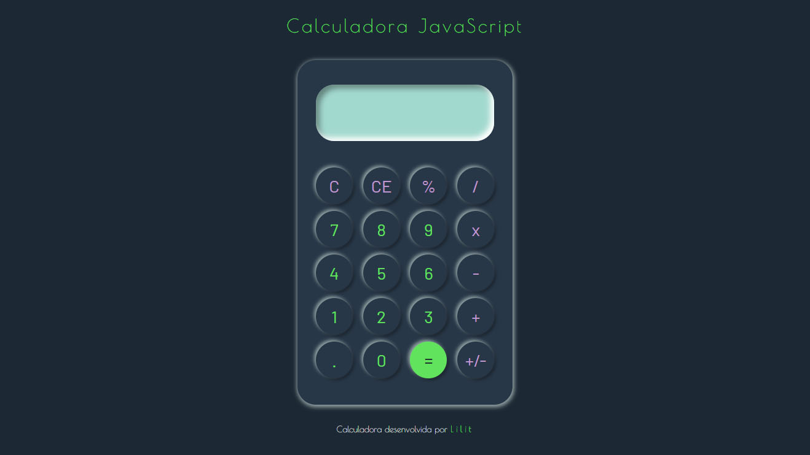

#  :snake: Criando calculadora para exercitar aprendizados no JavaScript :video_game:

- Exercício retirado do repositório:

  ​	 

- Todos os comentários são notas com justificativa do uso de cada elemento ou alterações minhas em relação aos projetos que usei para pesquisa;

  
  
  

